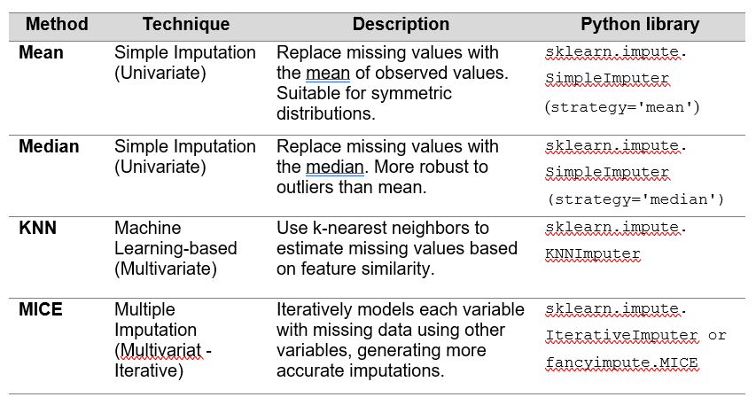
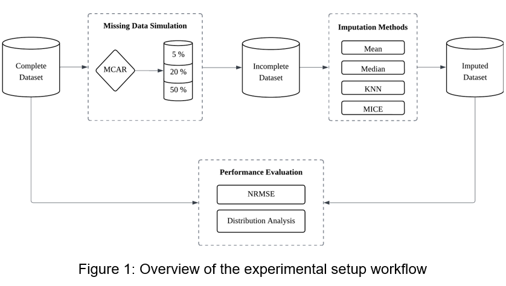
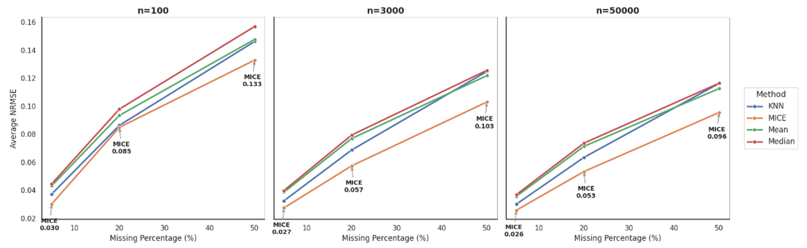
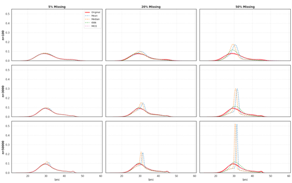

# Handling Missing Data in Administrative Records Using Imputation Methods

## 📌 Overview

Administrative data—such as records from hospitals, schools, or government agencies—is essential for research, policy decisions, and daily operations. However, these datasets often contain missing values due to incomplete reporting, human error, or system glitches. Ignoring these gaps can lead to misleading results and unreliable analyses.

Rather than simply deleting incomplete records, this project explores practical ways to fill in the blanks accurately using imputation techniques. By comparing simple methods (mean or median) with advanced approaches (KNN and MICE), we aim **to identify the most effective strategies for improving data quality**, ensuring datasets remain reliable, accurate, and useful for real-world decision-making

---
  
## ⚙️ Methodology 
In this study, a synthetic dataset (simulated_medical_records) designed to mimic clinical administrative data, consisting of 20 continuous variables such as body mass index (BMI), blood pressure, glucose, and cholesterol. The dataset is generated in three different sample sizes (n = 100, 3,000, and 50,000) to represent small to large-scale administrative records

### 📋 Imputation Methods Overview

The table below summarizes the imputation methods used in this study, including the technique, a brief description, and the Python library applied.

  

### 🔄 Experimental Workflow

The figure below illustrates the overall experimental workflow, including **missing data simulation**, **imputation**, and **evaluation**.

  

**Workflow Steps:**

1. **Missing Data Simulation**  
   Missing values are introduced using the `mdatagen` Python library, simulating missingness at **5%**, **20%**, and **50%** under a **Missing Completely at Random (MCAR)** mechanism.

2. **Imputation**  
   The selected imputation methods are applied using appropriate Python libraries to estimate and replace missing values.

3. **Evaluation**  
   The imputed datasets are evaluated by comparing them with the original complete dataset using **Normalized Root Mean Squared Error (NRMSE)** to measure accuracy, along with **distribution plots** to assess how well each method preserves the original data structure.

---

## 🔍 Findings

### 📈 Imputation Accuracy

The results show that **Multiple Imputation by Chained Equations (MICE)** consistently achieved the highest imputation accuracy across all sample sizes and missingness levels. **K-Nearest Neighbors (KNN)** followed closely, demonstrating strong performance, particularly in larger datasets. In contrast, traditional approaches such as **Mean** and **Median** imputation produced higher **Normalized Root Mean Square Error (NRMSE)** values, with error magnitudes increasing as the proportion of missing data grew.

  

### 📉 Distribution Preservation

The distributional results illustrate how each imputation method affects the shape of the **BMI** variable. **MICE** consistently preserved the original data distribution across all experimental scenarios, even at **50% missingness**. **KNN** also maintained a close approximation, particularly as the sample size increased. In contrast, **Mean** and **Median** imputation introduced noticeable distortions, most notably sharp central peaks, indicating oversmoothing and bias toward central values. These effects were especially pronounced in smaller datasets (**n = 100**), highlighting the sensitivity of simple imputation methods to data sparsity.

  

---

## ✅ Conclusion

This project highlights the importance of selecting appropriate imputation techniques when working with incomplete administrative data. Advanced methods such as **MICE** provide more accurate and reliable results, especially when data quality is critical for analysis and decision-making. The findings support the use of robust imputation strategies in real-world administrative and clinical data applications.

---

## 🛠 Tools & Technologies

- Python  
- scikit-learn (`SimpleImputer`, `KNNImputer`, `IterativeImputer`)  
- Statistical evaluation using NRMSE    

---

## 📚 Publication

Osman, N. A., Yaacob, S., & Mohd Azmi, N. F. (2025). Handling missing data in administrative records through 
imputation methods for data quality improvement. International Journal of Business and Technology Management, 7(9), 297
308 https://doi.org/10.55057/ijbtm.2025.7.9.23.

